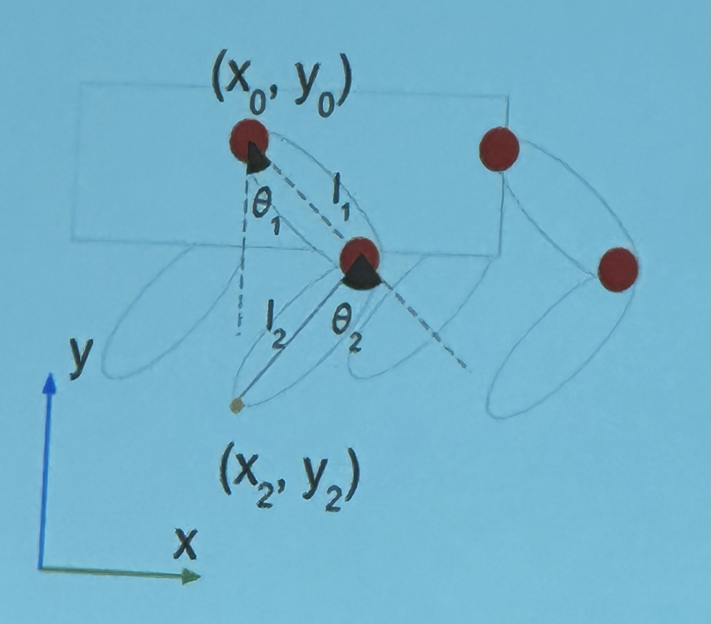
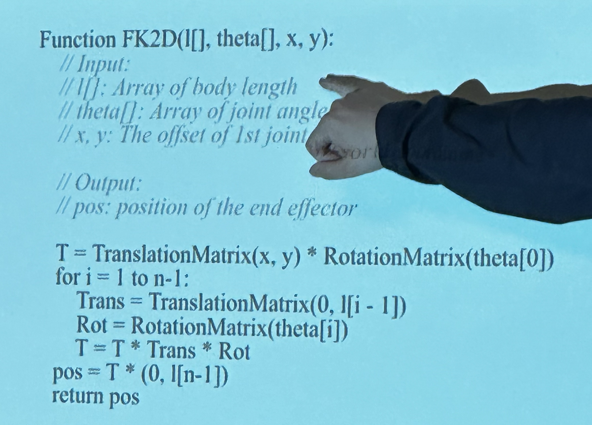

# Pose

- Define pose of robot:
    - $q = (x, y, z)$ → This can be location of the base.
    - $q = (x, y, z, r, p, y)$ → This can be the location of the base, as well as the rotation along the three axes of the base.
        - roll, pitch, yaw
- The robot has three degrees of freedom per leg. In total, there is twelve degrees of freedom.
    - As such, in total, we need six numbers for the base, as well as twelve numbers for each degree of freedom.

# End Effector

- The location of the feet of the robot.
    - $x = (x_e, y_e, z_e)$

# Forward Kinematics

- This is the mapping from the pose to the end effector location.
    - $x = FK(q)$
- Why do we care about forward kinematics?
    - So we can interpolate the location of the end effectors.
    - It’s so we can reason at the end effector space.
        - We need to know where the end effector is.

# Calculating Forward Kinematics

- We first calculate the position of $(x_1, y_1)$, the location of the elbow joints.
    - $x_1 = l_1 \sin\theta_1 + x_0$
    - $y_1 = -l_1 \cos \theta_1 + y_0$
- We now calculate the position of the end effector.
    - $x_2 = x_1 - l_2 \sin(\theta_2 - \theta_1)$
    - $y_2 = y_1 - l_2 \cos(\theta_2 - \theta_1)$
- We do $\theta_2 - \theta_1$ to get it into vertical frame of reference.w

# Coordinate Systems

- Local coordinate: the coordinate system that is attached to the joint of the robot.
    - If the robot joint moves, the entire coordinate system moves.
        - Basically the axes are aligned to the joint.
- When the end effector moves:
    - The coordinate in the local coordinate does not change.
    - The coordinate in the world coordinate does change.

# General Forward Kinematics

- $T_{w \to j_1} * T_{j_1 \to j_2}* \dots$
- Each of the $T$ is a transformation matrix, going from the world coordinate system, then through each local coordinate system.

# Homogeneous Coordinate

- For points, the coordinate is $[x, y, 1]$ because we can change the location of the point.
- For vectors, the coordinate is $[x, y, 0]$ because we can’t change the magnitude of the vector.
- A 2D movement is 3D with homogeneous coordinates.

# General Approach

- Each transformation step is two matrices. First, we translate it to move it in the direction of the thing. Then, we rotate it to get it in line with the next coordinate system.
- $x_w = T_1R_1\dots T_nR_nx_l$

# Speed

- To make the code faster, you can do two things:
    - Use affine transformations $A_i = T_iR_i$
    - Multiply from the right
        - Do matrix vector multiplication instead of matrix-matrix multiplication

# Pseudocode

