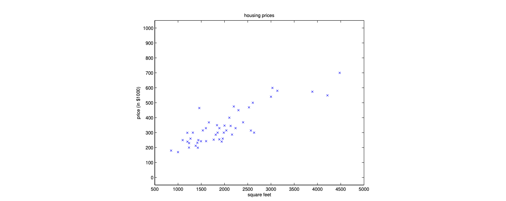
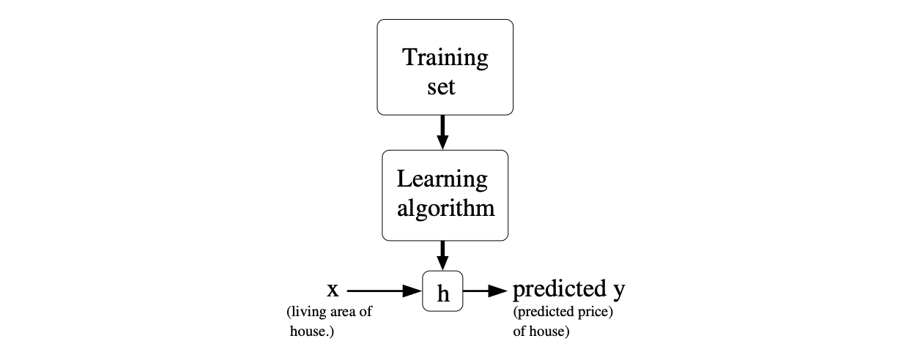

# 1 Problem
Consider the problem of predicting house prices based on features about a house\.

| Square Feet \(feet²\) | Number of Bedrooms | Price \($1000s\) |
| --------------------- | ------------------ | ---------------- |
| 2104                  | 3                  | 400              |
| 1416                  | 2                  | 232              |
| 1534                  | 3                  | 315              |
| 852                   | 2                  | 178              |

We can plot this data like below\.

Given this information, how can we predict the house prices?
## 1.1 Notation
* $x^{\left(i\right)}=\left[x_1,\ x_2,…\right]$ denotes the **input features** \(ie, square feet, \# of bedrooms\)
* $y^{\left(i\right)}=\left[y_1,\ y_2,\ …\right]$ denotes the **target variable** \(ie, price\)
* $n$ denotes the number of training examples, where $\left(x^{\left(i\right)},\ y^{\left(i\right)}\right)$ denotes a single training example\.
* $m$ denotes the number of features in $x^{\left(i\right)}$\.
* $\theta$ is the vector of parameters \(aka weights\)\.

## 1.2 Prediction
Given the features, we want to predict $h_{\theta}\left(x\right)=\theta_0\ +\ \theta_1x_1+\theta_2x_2.$

* **Regression** is when the predicted value is continuous\.
* **Classification** is when the predicted value is discrete aross a small number of classes\.

# 2 Linear Regression
* For simplicity, define $x_0\ =\ 1$ so that $h_{\theta}\left(x\right)=\sum_{i=1}^m \theta_i x_i = \theta^Tx$ \.
* We want to choose a $\theta$ that makes $h(x)$ close to $y$ for the examples that we have.
* To do so, we can minimize the squared distance via a **cost function:**
$$
J(\theta) = \frac{1}{2}\sum_{i=1}^n (h_\theta(x^{(i)}) - y^{(i)})^2
$$
* The inner term of the sum is the squared error for each example.

# 3 Gradient Descent (LMS)
GD iteratively updates the parameters by gradually moving it towards the minimum, thereby making $J(\theta)$ smaller.
$$
\theta_j := \theta_j - \alpha \frac{\partial}{\partial \theta_j}J(\theta)
$$
where $\alpha$ is the learning rate. This update is performed all values of $j$.

When considering one training example, the derivative is below:

When considering all training examples (**batch gd**), the update rule becomes:1

Since this is performed for all $j$, we can collapse this into vector math:

## 3.1 SGD
* As opposed to batch gradient descent, where you consider all training examples before doing an update, we can **update for every example**.
	* This gets us more updates, albeit each one is lower quality.
	* However, it tends to get $\theta$ close to the minimum much faster.
* SGD is useful for large datasets where summing over all examples is not efficient.

## 3.2 Mini-batch GD
* Similar to batch but instead of summing over entire dataset, we sum over a batch of 32 or 64 examples.
	* This is kinda the middleground between SGD and batch.
* In terms of comparison:
	* Doing 16 SGD steps gives better results than 1 mini-batch step with size 16.
	* However, minibatch is more easily parallelized so its preferred for costs.
* This is most common for larger datasets.

## 3.3 Choosing LR
* Try values and see the largest learning rate that drives $J(\theta)$ down quickly without diverging.
* Andrew likes factors of 3 -> 0.1 to 0.3 to 1 to 3 to 10 …

# 4 Analytically Solving Linear Regression
* Linear regression is one of the few problems where you can directly compute $\theta$.

* We define the notion of the gradient of a function with respect to a matrix.

* Revisiting the problem, define a **design matrix** $X$ for inputs and vector $y$ for targets.

* Using this new matrix definition, we can derive the cost function again.

* To find the minimum, we set this derivative to zero and solve. This gives us the **normal equations**.
$$
X^TX\theta=X^T \vec{y}
$$
* Therefore, the value for $\theta$ that minimizes $J(\theta)$ is equal to:
$$
\theta = (X^TX)^{-1}X^T\vec{y}
$$

* In practice, this does not work well when there are many features because $X^T X$ can get very large.
	* Since $X$ is an $n \times (m+1)$ matrix, $X^T X$ is an $(m+1) \times (m+1)$ matrix.

# 5 Gradients w.r.t to a Matrix

